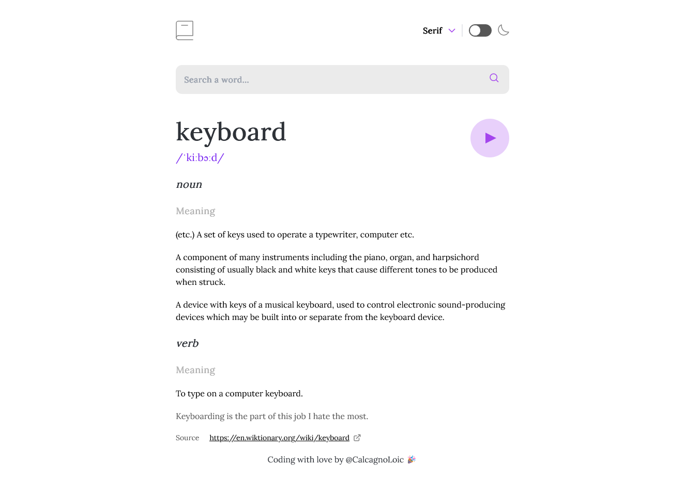
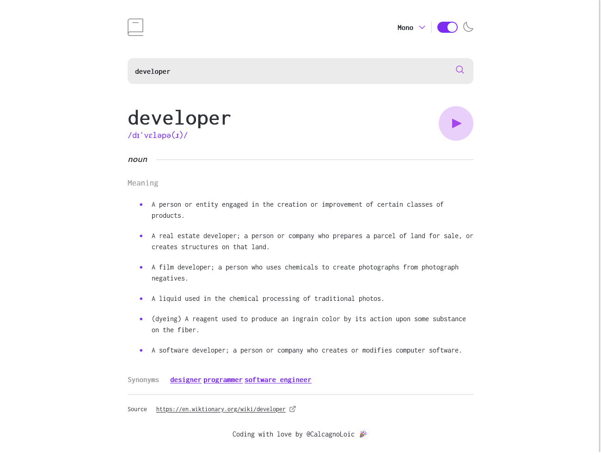
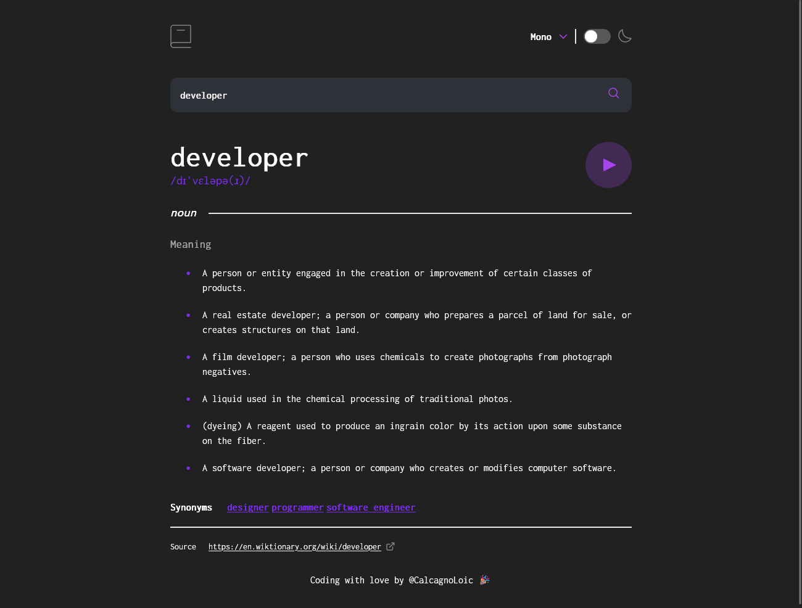
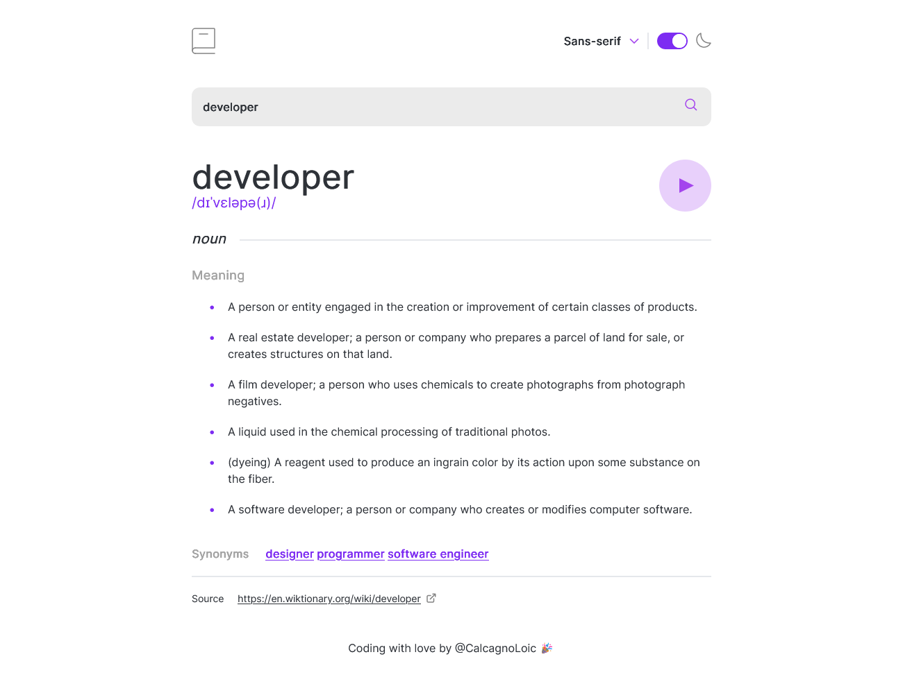
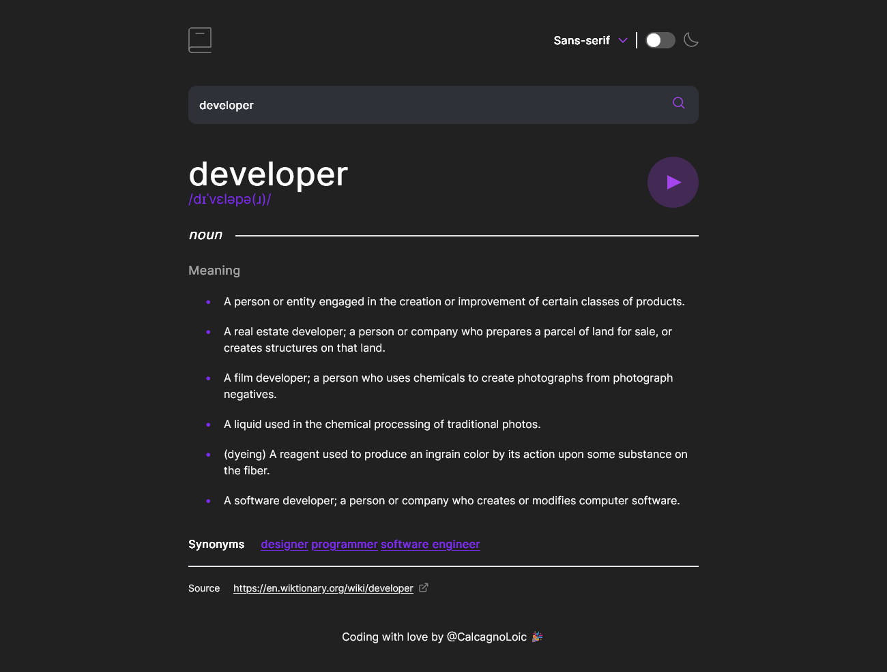

# Dictionary WebApp

This dictionary provides definitions and examples by lexical field. Two contexts are included:

- One for darkMode (this adapts to the user's system preferences)
- One for changing the font (serif, sans-serif and mono)

The stories are hosted on Chromatic at this [URL](https://65c4faea26944c656f6474a3-hvxcsqaonk.chromatic.com/).

  

   

## User Stories

Users should be able to:

- [x] Search for words using the input field
- [x] See the Free Dictionary API's response for the searched word
- [x] See a form validation message when trying to submit a blank form
- [x] Play the audio file for a word when it's available
- [x] Switch between serif, sans serif, and monospace fonts
- [x] Switch between light and dark themes
- [x] View the optimal layout for the interface depending on their device's screen size
- [x] See hover and focus states for all interactive elements on the page
- [x] Bonus: Have the correct color scheme chosen for them based on their computer preferences.

## View

| Serif font + light mode                | Serif font + dark mode                |
| -------------------------------------- | ------------------------------------- |
|  |  |

| Sans-serif font + light mode                | Sans-serif font + dark mode                |
| ------------------------------------------- | ------------------------------------------ |
|  |  |

| Mono font + light mode                 | Mono font + dark mode                 |
| -------------------------------------- | ------------------------------------- |
|  |  |

## Built with

- Semantic HTML5 markup
- Mobile-first workflow
- TailwindCSS
- React
- Storybook
- Chromatic

## Author

- Website - [Portfolio](https://calcagno-loic.netlify.app/)
- Frontend Mentor - [@CalcagnoLoic](https://www.frontendmentor.io/profile/CalcagnoLoic)
